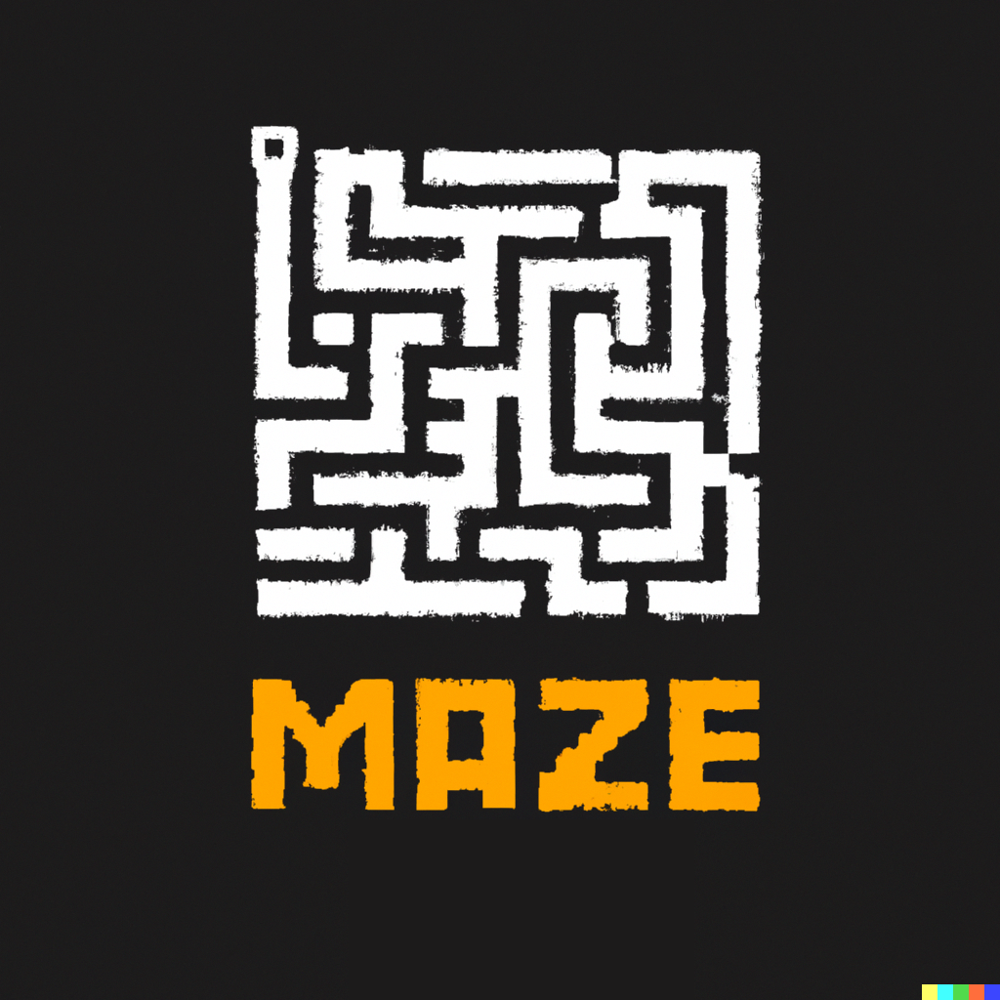

# **Maze Breaker DELUXE**

---

## Requirement :

To launch the game you need to have python installed and to install the needed packages with : `pip install -r requirements.txt`. 
Then launch the game with : `python __main__.py`. 
Or use windows installer :
* [Maze Breaker DELUXE.exe](Maze%20Breaker%20DELUXE.exe)
* Then execute `start '.\Maze Breaker DELUXE.exe'` in a windows command prompt.

---

## How to play:
Play the game using the directional keys and the enter key, escape in less than 5 minutes from the mazes to earn as many points as possible, remembering to collect as many diamonds as possible.

---

## Tools we used:

* Blue (code formatter): 
  * https://pypi.org/project/blue/
  
* Pdoc (Docstring generator):
  * https://pdoc3.github.io/pdoc/
    (`python pdoc --html`)
  
* Pygame: 
  * https://www.pygame.org

* Cx_Freeze (Compiler):
  * https://cx-freeze.readthedocs.io/
    (`python CreateEXE.py build`)

---

## Credits (royalty free for non-commercial_only):

* Graphical assets: 
  * https://devilsgarage.com/
  * https://bdragon1727.itch.io/platformer-ui-buttons
  * https://vnitti.itch.io/grassy-mountains-parallax-background
* Sound effects: 
  * https://mixkit.co/free-sound-effects/
* Music: 
  * https://soundcloud.com/adhesivewombat
* The logo was created with Dall-E: 
  * https://openai.com/product/dall-e-2
            
